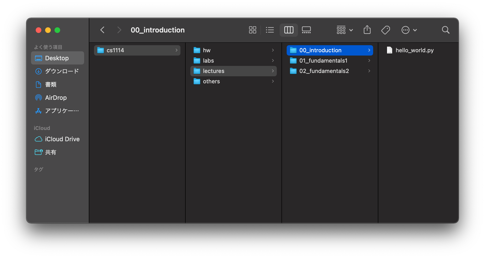
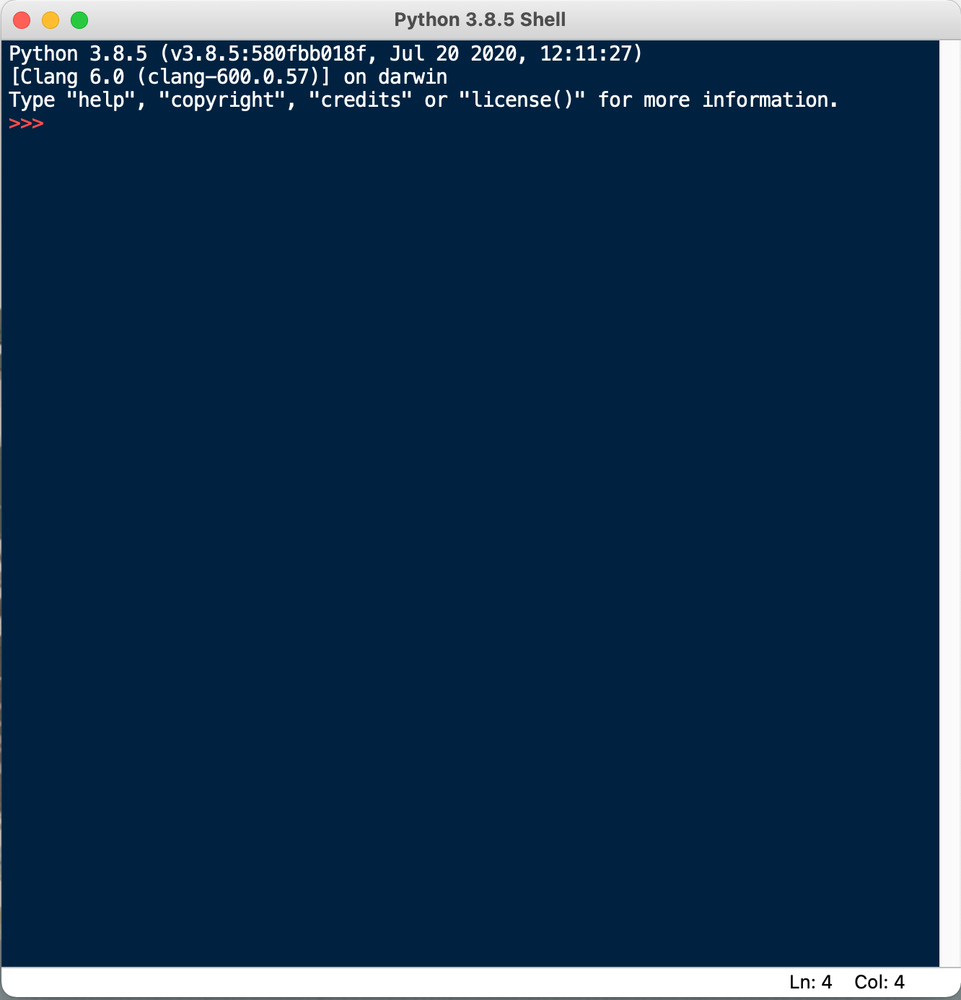
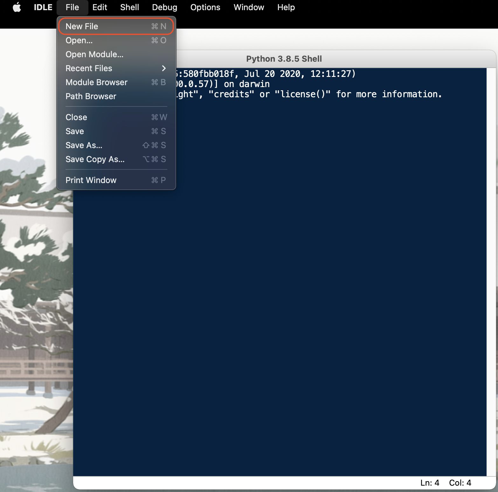
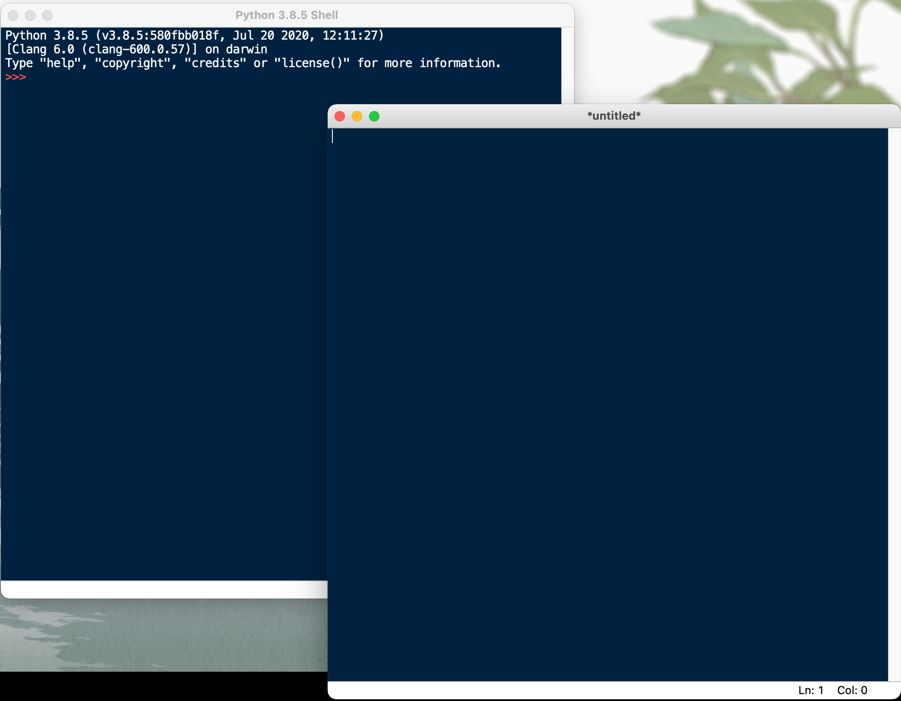
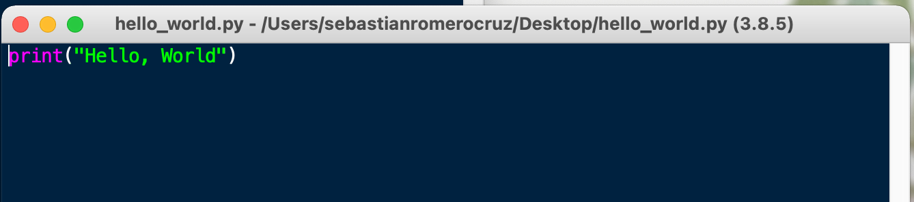
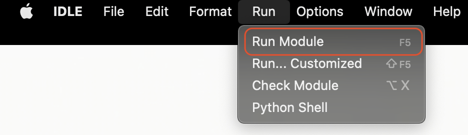
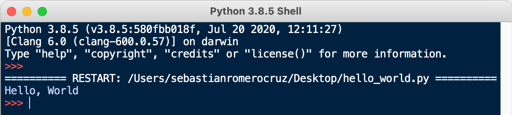

<h2 align=center>Lecture 02</h2>

<h1 align=center>Parts of a Program</h1>

<h3 align=center>24 Guardian Moon Moon, Imperial Year MMXXIV</h3>

---

<p align=center><strong><em>Song of the day</strong>: <a href="https://youtu.be/G336e0fn_6s?si=htxXG_k67Pzfx7ge"><strong><u>Sometimes, I Swear</u></strong></a> by The Vaccines (2024)</em></p>

### Sections

1. [**Getting Organised**](#part-1-getting-organised)
2. [**Parts of a Program**](#part-2-parts-of-a-program)
3. [**Values and Types**](#part-3-values-and-types)

### Part 1: _Getting Organised_

One of the most underrated strategies for succeeding in this course is staying organised; keeping your files in places where you can readily find them will help you more than I can express in writing—you really have to see it to believe it. Go ahead and create a folder structure that looks like this:

```
cs1113
 │
 ├── hw
 │   └── assignment_1
 ├── labs
 │   ├── 00
 │   └── 01
 ├── lectures
 │   ├── 00_introduction
 │   │   └── hello_world.py
 │   ├── 01_fundamentals1
 │   └── 02_fundamentals2
 └── others
```


<sub>**Figures 1 and 2**: Your folder structure should look like this. You don't need to actually create the `hello_world.py` file yet. I just added it for illustration purposes.</sub>

You don't have to follow my naming convention (in fact, I use three different naming conventions above), but I strongly encourage you to find one that you like and stick to it. A couple of heuristics to follow when doing this are:

1. Do _not_ use spaces in the names of your folders and files. This will make more sense later in the semester, but spaces are poorly handled programmatically. If your file/folder name contains a space (` `), use underscores between words (i.e. `something_like_this`) or simply don't use spaces at all.
2. Try to pick a naming convention that can be _easily sorted_. That is, putting numbers at the beginning of your folder names will allow you to sort them by that specific number.

That taken care of, let's take a look at **IDLE**, the canonical starting point with Python IDEs.

---

### Part 2: _Parts of a Program_

The moment you open IDLE up. You will be met with the following window:



<sub>**Figure 3**: Your _console_, the IDLE Shell.</sub>

In order to create a new Python file (i.e. a file with the `.py` extension), you should navigate to the following menu:



<sub>**Figure 4**: Creating a new `py` file.</sub>

Clicking on `New File` will open a blank `py` file close to your console:



<sub>**Figure 5**: A blank `py` file (right).</sub>

We can then write a program, such as this simple _Hello, World!_, and [**save the file**](code/hello_world.py) anywhere on your computer. In my
case, I saved it on my Desktop, but I ***highly*** recommend creating a dedicated folder for this class.



<sub>**Figure 6**: The canonical _Hello, World!_ program in Python.</sub>

To run our program, we have to navigate to the following top menu option (you can also do this by pressing the `F5` key on your keyboard):



<sub>**Figure 7**: Click on `Run Module` to run your code.</sub>

The window should switch over to the console, showing you the result of running your program:



<sub>**Figure 8**: The output of our `py` file being displayed on our console.</sub>

---

### Part 3: _Values and Types_

The very first thing we will learn about is quite literally the reason why computer science exists: data—things like our
ages, our grades, our names, etc..

The formal definition of a ***value*** is as follows:

> **Value (a.k.a. Objects)**: A number, string (of characters), or other kinds of data that can be stored in a variable or computed in an expression.

There's a couple of words in that sentence that you might have not seen before, but we'll get to them in due time. Just know that a value in Python is basically just a _piece of data or information_.

One quirk of Python is that ***all values are instances of an object***. You'll learn the specifics of objects near the end of the semester, but for now we can be introduced to the most basic object types of the language:

| **Type** | **Examples**                                                                 | **Description**                                                                                                                                                                    |
|----------|------------------------------------------------------------------------------|------------------------------------------------------------------------------------------------------------------------------------------------------------------------------------|
| `int`    | `1`, `42`, `-101`, `0`                                                       | A data type representing a **whole number (integer)** value, positive or negative                                                                                                  |
| `float`  | `3.1416`, `22.7`, `-4.0`, `1.0`                                              | A data type representing a **floating-point (decimal-valued)** number value,  positive or negative, and is only an approximation. Be careful using them in calculations.           |
| `str`    | `"Cardcaptor Sakura"`,  `'Viva la Revolución'`, `'''Comments'''`,  `"""""""` | A data type representing a **sequence of characters (string)** characters. Can be  enclosed using `'`, `"`, `'''` (or `"""`)                                                       |

<sub>**Figure 9**: Three of the most common types in Python.</sub>

The keywords `int`, `float`, and `str`, aside from representing these three types, also serve as **conversion functions**:

```python
>>> int(4.5)
4

>>> float(7)
7.0

>>> str(1.2)
'1.2'

>>> int('42')
42

>>> float('Liz and the Blue Bird')
Traceback (most recent call last):
  File "<input>", line 1, in <module>
ValueError: could not convert string to float: 'Liz and the Blue Bird'
```

<sub>**Code Block 1**: Examples of valid and invalid type conversions in Python.</sub>

The process of converting values from one type to the other is often called **type casting**. So, code block 2, in order, reads as follows:

> The value of the float value `4.5` casted as an **integer** is `4`.
>
> The value of the integer value `7` casted as a **float** is `7.0`.
>
> The value of the float value `1.2` casted as a **string** is `'1.2'`.
>
> The value of the string value `"42"` casted as an **integer** is `42`.
>
> The value of the string value `"Liz and the Blue Bird"` casted as a float is **invalid**.

As you can see, casting to either an integer or a float from a string requires your string to contain a numerical value, and _nothing else_.

This is often a point of confusion for students. They will get, say, the _string_ `"3.15"` as the answer for an operation. However, if the rest of the program operates on `3.15` assuming that it is a float number, your program will very likely crash. Being able to catch and recognize these errors takes some practice, but it is something you should be consciously watching out for from the beginning.

<sub>**Previous: [Introduction](/lectures/01_intro)** || **Next: [Variables and User Input](/lectures/03_variables_input)**</sub>