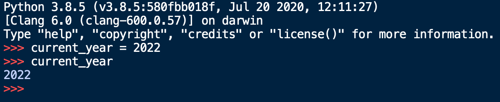
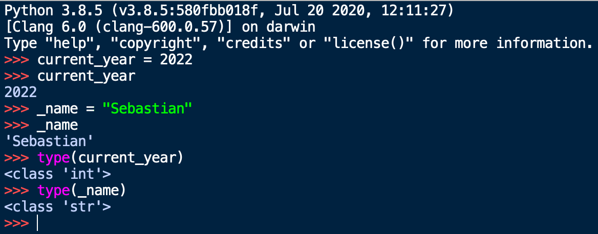
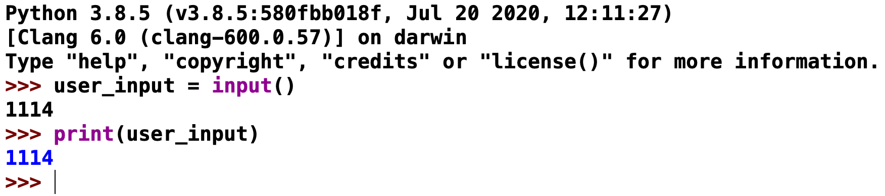
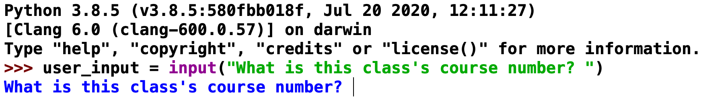
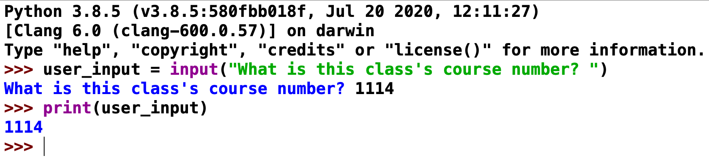
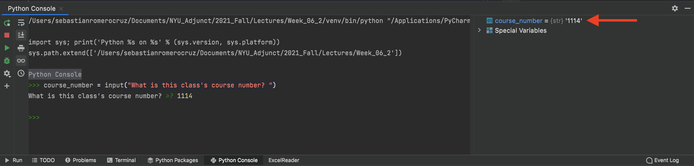

<h2 align=center>Lecture 02</h2>

<h1 align=center>Parts of a Program</h1>

<h3 align=center>11 Horsebow Moon, Imperial Year 2023</h3>

---

<p align=center><strong><em>Song of the day</strong>: <a href="https://youtu.be/-xoxu1zHiSY?si=pgKx3HYbEiUzBO4V"><strong><u>Dreamer</u></strong></a> by Laufey (2023)</em></p>

### Sections

1. [**Getting Organised**](#part-1-getting-organised)
2. [**Parts of a Program**](#part-2-parts-of-a-program)
3. [**Values and Types**](#part-3-values-and-types)
4. [**Variables**](#part-4-variables)
5. [**Program Input**](#part-5-program-input)

### Part 1: _Getting Organised_

One of the most underrated strategies for succeeding in this course is staying organised; keeping your files in places where you can readily find them will help you more than I can express in writing—you really have to see it to believe it. Go ahead and create a folder structure that looks like this:

```
cs1114
 │
 ├── hw
 │   └── assignment_1
 ├── labs
 │   ├── 00
 │   └── 01
 ├── lectures
 │   ├── 00_introduction
 │   │   └── hello_world.py
 │   ├── 01_fundamentals1
 │   └── 02_fundamentals2
 └── others
```


<sub>**Figures 1 and 2**: Your folder structure should look like this. You don't need to actually create the `hello_world.py` file yet. I just added it for illustration purposes.</sub>

You don't have to follow my naming convention (in fact, I use three different naming conventions above), but I strongly encourage you to find one that you like and stick to it. A couple of heuristics to follow when doing this are:

1. Do _not_ use spaces in the names of your folders and files. This will make more sense later in the semester, but spaces are poorly handled programmatically. If your file/folder name contains a space (` `), use underscores between words (i.e. `something_like_this`) or simply don't use spaces at all.
2. Try to pick a naming convention that can be _easily sorted_. That is, putting numbers at the beginning of your folder names will allow you to sort them by that specific number.

That taken care of, let's take a look at **IDLE**, the canonical starting point with Python IDEs.

### Part 2: _Parts of a Program_

The moment you open IDLE up. You will be met with the following window:


<sub>**Figure 3**: Your _console_, the IDLE Shell.</sub>

In order to create a new Python file (i.e. a file with the `.py` extension), you should navigate to the following menu:


<sub>**Figure 4**: Creating a new `py` file.</sub>

Clicking on `New File` will open a blank `py` file close to your console:


<sub>**Figure 5**: A blank `py` file (right).</sub>

We can then write a program, such as this simple _Hello, World!_, and [**save the file**](code/hello_world.py) anywhere on your computer. In my
case, I saved it on my Desktop, but I ***highly*** recommend creating a dedicated folder for this class.


<sub>**Figure 6**: The canonical _Hello, World!_ program in Python.</sub>

To run our program, we have to navigate to the following top menu option (you can also do this by pressing the `F5` key on your keyboard):


<sub>**Figure 7**: Click on `Run Module` to run your code.</sub>

The window should switch over to the console, showing you the result of running your program:


<sub>**Figure 8**: The output of our `py` file being displayed on our console.</sub>

### Part 3: _Values and Types_

The very first thing we will learn about is quite literally the reason why computer science exists: data—things like our
ages, our grades, our names, etc..

The formal definition of a ***value*** is as follows:

> **Value (a.k.a. Objects)**: A number, string (of characters), or other kinds of data that can be stored in a variable or computed in an expression.

There's a couple of words in that sentence that you might have not seen before, but we'll get to them in due time. Just know that a value in Python is basically just a _piece of data or information_.

One quirk of Python is that ***all values are instances of an object***. You'll learn the specifics of objects near the end of the semester, but for now we can be introduced to the most basic object types of the language:

| **Type** | **Examples**                                                                 | **Description**                                                                                                                                                                    |
|----------|------------------------------------------------------------------------------|------------------------------------------------------------------------------------------------------------------------------------------------------------------------------------|
| `int`    | `1`, `42`, `-101`, `0`                                                       | A data type representing a **whole number (integer)** value, positive or negative                                                                                                  |
| `float`  | `3.1416`, `22.7`, `-4.0`, `1.0`                                              | A data type representing a **floating-point (decimal-valued)** number value,  positive or negative, and is only an approximation. Be careful using them in calculations.           |
| `str`    | `"Cardcaptor Sakura"`,  `'Viva la Revolución'`, `'''Comments'''`,  `"""""""` | A data type representing a **sequence of characters (string)** characters. Can be  enclosed using `'`, `"`, `'''` (or `"""`)                                                       |

<sub>**Figure 9**: Three of the most common types in Python.</sub>

The keywords `int`, `float`, and `str`, aside from representing these three types, also serve as **conversion functions**:

```python
>>> int(4.5)
4

>>> float(7)
7.0

>>> str(1.2)
'1.2'

>>> int('42')
42

>>> float('Liz and the Blue Bird')
Traceback (most recent call last):
  File "<input>", line 1, in <module>
ValueError: could not convert string to float: 'Liz and the Blue Bird'
```

<sub>**Code Block 1**: Examples of valid and invalid type conversions in Python.</sub>

The process of converting values from one type to the other is often called **type casting**. So, code block 2, in order, reads as follows:

> The value of the float value `4.5` casted as an **integer** is `4`.
>
> The value of the integer value `7` casted as a **float** is `7.0`.
>
> The value of the float value `1.2` casted as a **string** is `'1.2'`.
>
> The value of the string value `"42"` casted as an **integer** is `42`.
>
> The value of the string value `"Liz and the Blue Bird"` casted as a float is **invalid**.

As you can see, casting to either an integer or a float from a string requires your string to contain a numerical value, and _nothing else_.

This is often a point of confusion for students. They will get, say, the _string_ `"3.15"` as the answer for an operation. However, if the rest of the program operates on `3.15` assuming that it is a float number, your program will very likely crash. Being able to catch and recognize these errors takes some practice, but it is something you should be consciously watching out for from the beginning.

### Part 4: _Variables_

Okay, so we have a way of representing data in the form of types, but how do we store this data so that we can use it in our programs? This is the job of ***variables***.

A good way of thinking of variables is as _boxes that store our belongings_ when we are moving. Usually, we store things in boxes to keep them safe and organized so that we can easily find and use them later on. Moreover, the best way to know which box holds what is to _label_ them—like putting a piece of tape with the contents written on it.

That's basically the exact same process we use in programming to ensure that our data is stored and easily accessible to us.

For example, if we wanted to store the current year, we'd do something like this in Python:

```python
current_year = 2022
```

In this statement, `current_year` is the name of the variable, `=` is the **assignment operator**, and `2021` is the
value.

If I try doing this in IDLE's console, you'll see this:



<sub>**Figure 10**: A visualization of Python storing the integer value `2021` inside a variable called `current_year`.</sub>

Now, I could have called this variable anything I wanted. As long as your variable names start with an alphabetic
character or an underscore (`_`), you are not restricted in any way:



<sub>**Figure 9**: A visualization of Python storing integer and string values inside variables `_name`, `current_year`,
`x`.</sub>

Technically speaking a variable represents a value store in your computer's memory. When you create a variable, you are
basically telling your computer something like this:

> Hey, I want you to store the string of characters `"Sebastián"` inside a memory address. I want you to call this memory address
> `_name` so I know where I can find this string if I ever need it.

In memory, this might look like this

```text
                │
                │               ~~~~~~~~~~~~~~~
                │                │———————————│
                │         unused │ mem_loc a │
  "Sebastián"   │                │———————————│
       |        │         unused │ mem_loc b │     
       |        │                │———————————│
       |        │         unused │ mem_loc c │
       v        │                │———————————│
    _name ------│--------> _name │ mem_loc d │
                │                │———————————│
                │         unused │ mem_loc e │
                │                │———————————│
                │               ~~~~~~~~~~~~~~~
                │
—————————————————————————————————————————————————
   Programmer                     Computer
```

<sub>**Figure 11**: The memory model of creating a variable called `_name`, which is storing the string value
`"Sebastián"`. The identifier `name` is only for **you** to be able to easily access this value. To your computer,
though, this is just memory location d (`memo_loc d`).</sub>

Now, of course, not all variable names are understood equally. Just like labels on boxes, giving your variables relevant,
explicative names is the way to go. In this class, in particular, make sure to follow these rules in order to not get
points taken off:

1. Make sure your variables have useful names (i.e. favor `acceleration_of_gravity = 9.81` over `aog = 9.81`).
2. Do not, and I repeat, do ***not*** give your variables single-letter variable names. This will always be penalized
   (with a single exception that we won't get into for a while).
3. Follow either snake-case (`sound_euphonium_2`), or camel-case (`soundEuphonium2`); this, of
course, means that variables are case-sensitive (i.e. `hello_world` and `HELLO_WORLD` are two different, completely
unrelated variable names).
4. They cannot be a Python keyword (`if`, `def`, `while`, etc.).

A couple of technical terms that you should be aware of are **namespace** and **object space**. Simply put, the namespace
is where the names of your variables are stored, and the object space is where the values of your variables are stored:


<sub>**Figure 12**: Examples of namespace vs. object space connections.</sub>

These basically refer to the way values are stored and referenced in your computer's memory. You don't have to know much more about this for this course, so don't stress.

### Part 5: _Program Input_

So, we learned that we can display the values of variables and expressions by means of the `print()` function:

```python3
lecture_id = 8
print(lecture_id)

message = "オマエはもう死んでいる。"
print(message)
```
Output:
```text
8
オマエはもう死んでいる。
```

That's a great thing to be able to do, and we'll be making ample use of this faculty. However, what kind of programs would we realistically be writing if we weren't able to interact with our user? After all, almost every program that is useful to us in some way gets our input; your phone registers your touch as an input, your laptop registers every key stroke as an input, a camera registers light as input. Input, input, input.

It stands to reason, then, that this should be the next thing we need to focus on.

The most basic form of user interaction in Python is done through a very succinctly named built-in function—`input()`.

At its most basic level, it functions as follows:

```python
user_input = input()

print(user_input)
```

If we run this program, you will see that our shell window will pause, and wait for an action from us:


_**Figure 13**: Our shell prompting us for input._

If we type something in—say, the course number for this class—and press "enter", you will see the following behavior:



_**Figure 14**: Our shell displaying our input._

This works just fine. But typically speaking, we want our programs to be as intuitive and user-friendly as possible—to
have good [**UI**](https://en.wikipedia.org/wiki/User_interface) and 
[**UX**](https://en.wikipedia.org/wiki/User_experience), in other words. The `input()` function allows us to give the 
user a "prompt" message by putting it, ***in string form***, inside the `input()` function's parentheses:

```python
course_number = input("What is this class's course number? ")

print(course_number)
```

If we ran this, our shell would prompt us the following way:



_**Figure 15**: Our shell prompting us for this class's course number._

Once we enter our desired input and press the "enter" key, we will see the following:



_**Figure 16**: Our shell displaying this class's course number._

These two programs, effectively, do the same exact thing (i.e. accepting user input and displaying), but in the first
one, we are barely even aware that we're being prompted for input—and we have no idea what input is supposed to even
_be_. The second example, by contrast, at the very least gives us a clear idea of the type and nature of our input.
It won't stop any user from entering the wrong thing, but at least we can say that we gave them some hints.

Now, interestingly, **Python saves all input in `str` form**, meaning that our input of "1114" is not saved as an 
integer, as one might expect, but as a string. Sure enough, if we run the same code on our console, we can very clearly
see that the variable `course_number` is a `str` object:



_**Figure 17**: PyCharm's console displaying the type of `course_number` on the right._

There is essentially no way of changing this behavior. Python, by design, received all input in string form. It's up to
us, the programmers, to parse that input into a usable form.

---

<!-- <sub>**Previous: [Introduction](/lectures/01_intro)** || **Next: Operators and Expressions**</sub> -->

<sub>**Previous: [Introduction](/lectures/01_intro)** || **Next: [Programming Fundamentals 2](/lectures/03_operators)**</sub>