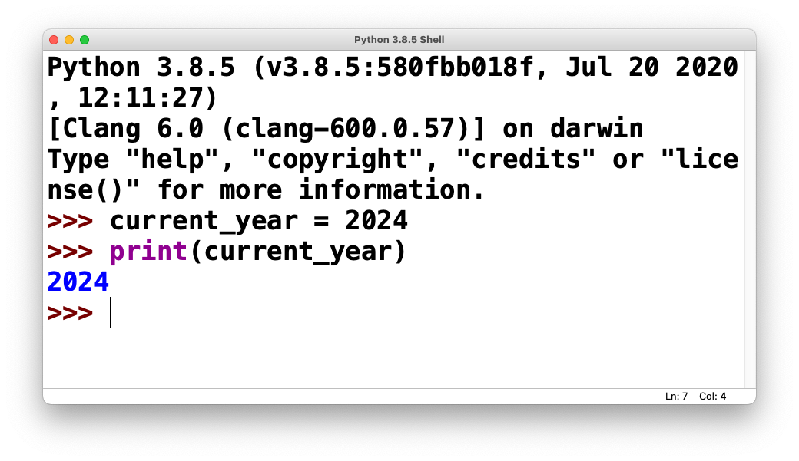
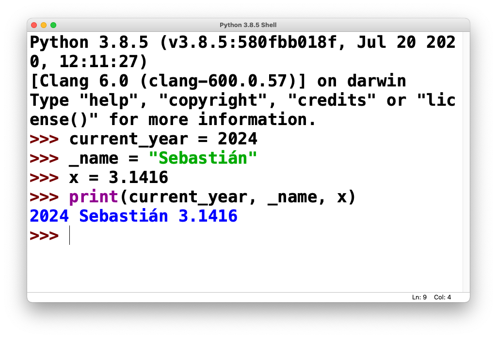
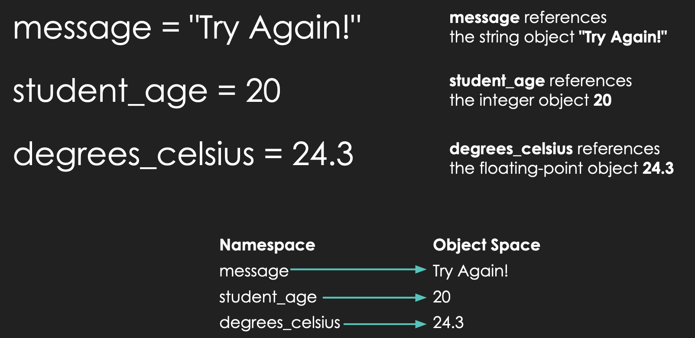
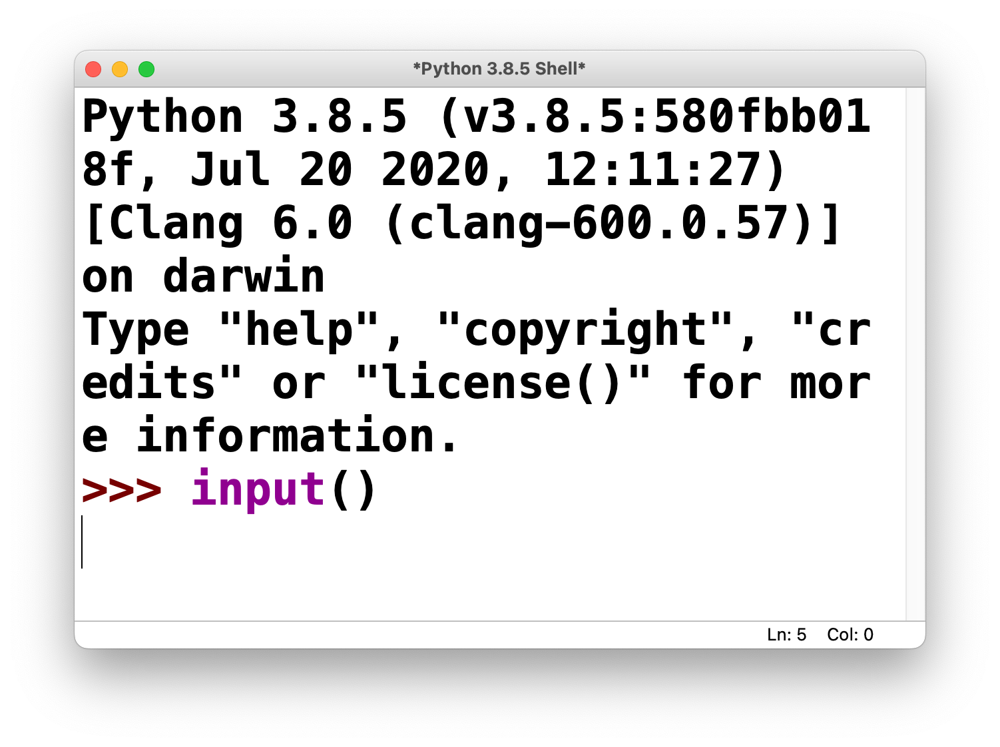
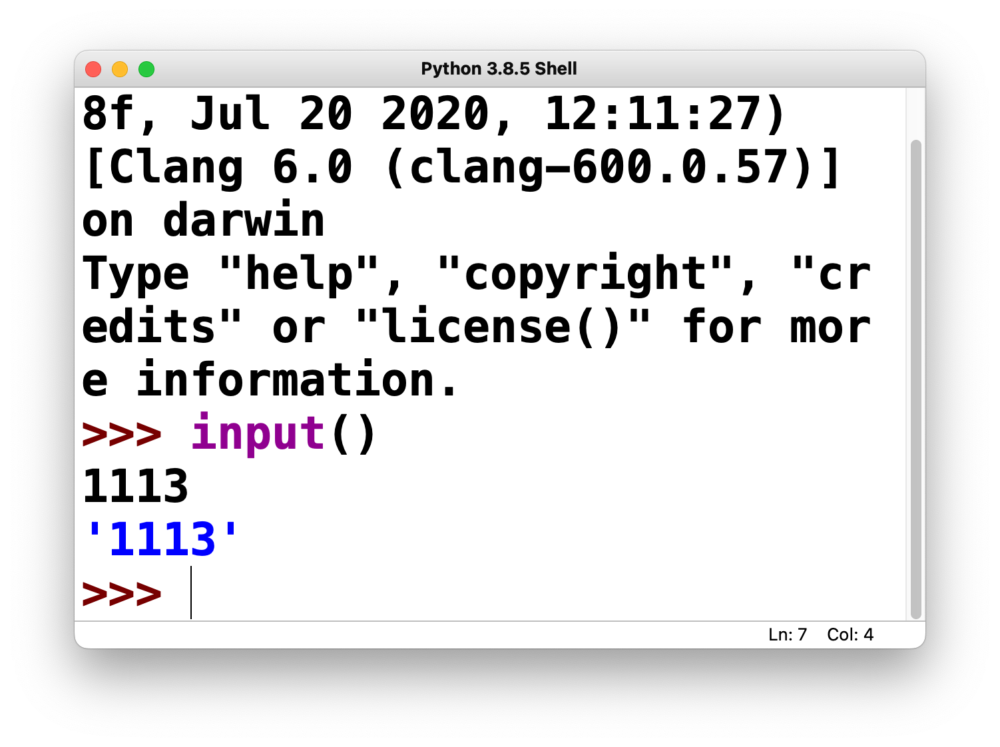
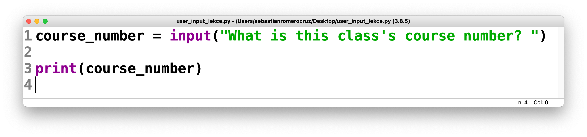
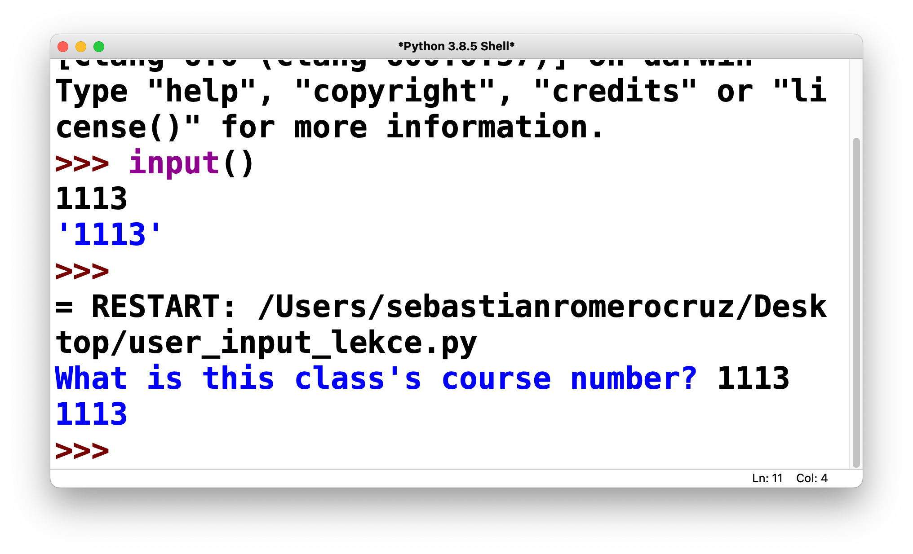
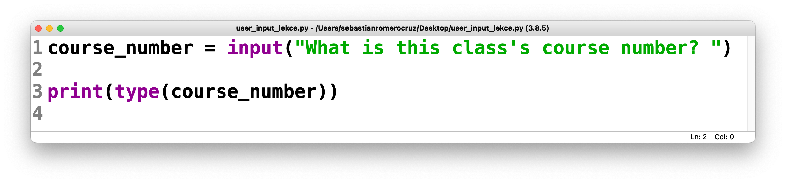
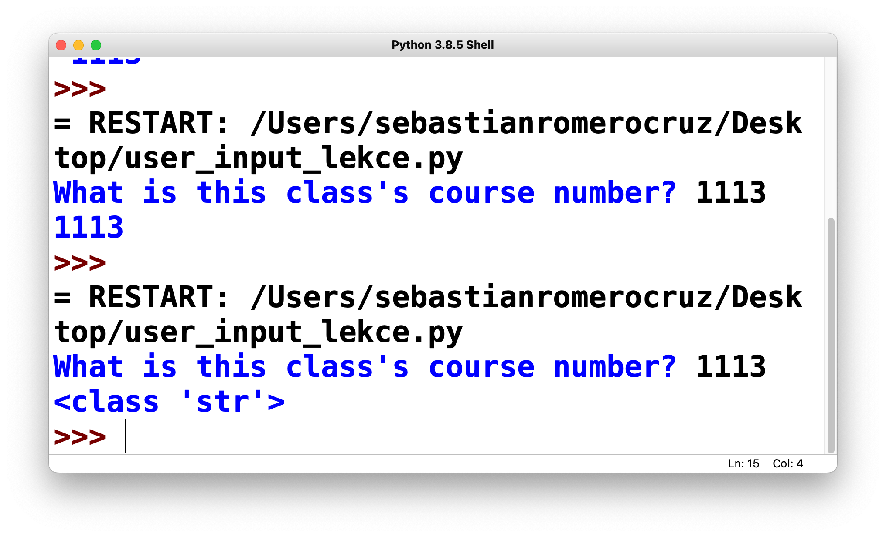

<h2 align=center>Lecture 03</h2>

<h1 align=center>Variables and User Input</h1>

<h3 align=center>29 Guardian Moon Moon, Imperial Year MMXXIV</h3>

---

<p align=center><strong><em>Song of the day</strong>: <a href="https://youtu.be/4t0xeWFCHho?si=UT042DG2My_mLj86"><strong><u>In The End It Always Does</u></strong></a> by The Japanese House (2023)</em></p>

### Sections

1. [**Variables**](#part-1-variables)
2. [**User Input**](#part-2-user-input)

### Part 1: _Variables_

Okay, so we have a way of representing data in the form of types, but how do we store this data so that we can use it in our programs? This is the job of ***variables***.

A good way of thinking of variables is as boxes that store our belongings when we are moving. Usually, we store things in boxes to keep them safe and organized so that we can easily find and use them later on. Moreover, the best way to know which box holds what is to label them—like putting a piece of tape with the contents written on it.

That's basically the exact same process we use in programming to ensure that our data is stored and easily accessible to us.

For example, if we wanted to store the current year, we'd do something like this in Python:

```python
current_year = 2024
```

In this statement, `current_year` is the name of the variable, `=` is the **assignment operator**, and `2024` is the value.

If I try doing this in IDLE's console, you'll see this:



<sub>**Figure 1**: A visualization of Python storing the integer value `2024` inside a variable called `current_year`.</sub>

Now, I could have called this variable anything I wanted. As long as your variable names start with an alphabetic character or an underscore (`_`), you are not restricted in any way:



<sub>**Figure 2**: A visualization of Python storing integer and string values inside variables `_name`, `current_year`, `x`.</sub>

Technically speaking a variable represents a value store in your computer's memory. When you create a variable, you are basically telling your computer something like this:

> Hey, I want you to store the string of characters `"Sebastián"` inside a memory address. I want you to call this memory address `_name` so I know where I can find this string if I ever need it.

In memory, this might look like this

```text
                │
                │               ~~~~~~~~~~~~~~~
                │                │———————————│
                │         unused │ mem_loc a │
  "Sebastián"   │                │———————————│
       |        │         unused │ mem_loc b │     
       |        │                │———————————│
       |        │         unused │ mem_loc c │
       v        │                │———————————│
    _name ------│--------> _name │ mem_loc d │
                │                │———————————│
                │         unused │ mem_loc e │
                │                │———————————│
                │               ~~~~~~~~~~~~~~~
                │
—————————————————————————————————————————————————
   Programmer                     Computer
```

<sub>**Figure 3**: The memory model of creating a variable called `_name`, which is storing the string value `"Sebastián"`. The identifier `name` is only for **you** to be able to easily access this value. To your computer, though, this is just memory location d (`memo_loc d`).</sub>

Now, of course, not all variable names are understood equally. Just like labels on boxes, giving your variables relevant, explicative names is the way to go. In this class, in particular, make sure to follow these rules in order to not get points taken off:

1. Make sure your variables have useful names (i.e. favor `acceleration_of_gravity = 9.81` over `aog = 9.81`).
2. Do not, and I repeat, do ***not*** give your variables single-letter variable names. This will always be penalized (with a single exception that we won't get into for a while).
3. Follow either snake-case (`sound_euphonium_2`), or camel-case (`soundEuphonium2`); this, of course, means that variables are case-sensitive (i.e. `hello_world` and `HELLO_WORLD` are two different, completely unrelated variable names).
4. They cannot be a Python keyword (`if`, `def`, `while`, etc.).

A couple of technical terms that you should be aware of are **namespace** and **object space**. Simply put, the namespace is where the names of your variables are stored, and the object space is where the values of your variables are stored:



<sub>**Figure 4**: Examples of namespace vs. object space connections.</sub>

These basically refer to the way values are stored and referenced in your computer's memory. You don't have to know much more about this.

---

### Part 2: _User Input_

Last week we learned that we can display the values of variables and expressions by means of the `print()`
function:

```python3
lecture_id = 8
print(lecture_id)

message = "オマエはもう死んでいる。"
print(message)

obvious_fact = 5 != "5"
print(obvious_fact)
```
Output:
```text
8
オマエはもう死んでいる。
True
```

That's a great thing to be able to do, and we'll be making ample use of this faculty. However, what kind of programs would we realistically be writing if we weren't able to interact with our user? After all, almost every program that is useful to us in some way gets our input; your phone registers your touch as an input, your laptop registers every key stroke as an input, a camera registers light as input. Input, input, input.

It stands to reason, then, that this should be the next thing we need to focus on.

The most basic form of user interaction in Python is done through a very succinctly named built-in function—`input()`.

At its most basic level, it functions as follows:

```python
user_input = input()

print(user_input)
```

If we run this program, you will see that our shell window will pause, and wait for an action from us:



<sub>**Figure 5**: Our shell prompting us for input.</sub>

If we type something in—say, the course number for this class—and press "enter", you will see the following behavior:



<sub>**Figure 6**: Our shell displaying our input.</sub>

This works just fine. But typically speaking, we want our programs to be as intuitive and user-friendly as possible—to have good [**UI**](https://en.wikipedia.org/wiki/User_interface) and [**UX**](https://en.wikipedia.org/wiki/User_experience), in other words. The `input()` function allows us to give the user a "prompt" message by putting it, ***in string form***, inside the `input()` function's parentheses:



<sub>**Figure 7**: A Python [**program**](code/user_input_lekce.py) prompting us for this class's course number.</sub>

If we ran this, our shell would prompt us the following way. Once we enter our desired input and press the "enter" key, we will see the following:



<sub>**Figure 8**: Our shell displaying this class's course number.</sub>

These two programs, effectively, do the same exact thing (i.e. accepting user input and displaying), but in the first one, we are barely even aware that we're being prompted for input—and we have no idea what input is supposed to even _be_. The second example, by contrast, at the very least gives us a clear idea of the type and nature of our input. It won't stop any user from entering the wrong thing, but at least we can say that we gave them some hints.

Now, **Python saves all input in `str` form**, meaning that our input of "1114" is not saved as an integer, as one might expect, but as a string. Sure enough, if we run the same code, but print the `type` of the result, we can very clearly see that the variable `course_number` is a `str` object:




<sub>**Figures 9 and 10**: IDLE displaying the type of `course_number` on the through the `type` function.</sub>

There is essentially no way of changing this behavior. Python, by design, received all input in string form. It's up to us, the programmers, to parse that input into a usable form by using, say, `int` or `float`.

See today's class notes ([**9:30am**](https://colab.research.google.com/drive/1jJAnjb23iWxTBUbU6idB04dI3MtEzk8p?usp=sharing) and [**3:30pm**](https://colab.research.google.com/drive/1q4ekmkE2O8fWVpzDRzfZSITzQ2ugn6CL?usp=sharing)) for the examples we did of these.

<sub>**Previous: [Parts of a Program](/lectures/02_parts_of_a_program)** || **Next: [Operators and Expressions]()**</sub>