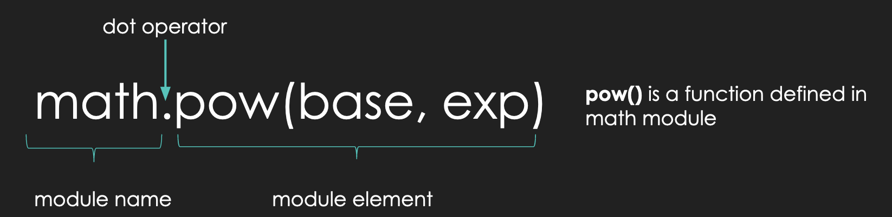
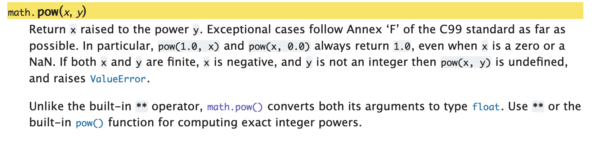

<h2 align=center>Week 04: <em>Day 2</em></h2>

<h1 align=center>Python Modules</h1>

<p align=center><strong><em>Song of the day</strong>: <a href="https://youtu.be/MkMTPnLdzzQ?si=3LIfcyjj2u1xasmd"><strong><u>Life During Wartime (Live in LA)</u></strong></a> by Talking Heads (1983)</em></p>

### Sections:

1. [**The `math` Module**](#part-2-the-math-module)
2. [**The `random` Module**](#part-3-the-random-module)

### Part 1: _The `math` Module_

You know how, in a previous lecture, I asked you to calculate the volume of a cone? For many mathematical operations, we need to use certain pre-defined constants, such as **pi**. In our case, I asked you to define a variable that would hold your best estimation of this value:

```python
pi = 3.14156  # for example
```

It might not come as too much of a surprise that approximating such common and important constants is very bad practice. This is especially the case because programming is often used in engineering applications where precision is of paramount importance. In other words, you are not going to tell your boss and NASA that you programmed a rover by "sort of guessing the value of pi." The great thing is that you really don't have to at all!

One of the great things about Python is that it has a ***huge*** community that constantly releases their code to the public—free of charge—for us to use. When we want to make use of this code, we have to import it in the form of a ***module***.

---

One of the most common modules is the `math` module which, as you can probably guess, contains a plethora of math-related functions and values that we can use:

```python
import math

pi = math.pi
e = math.e

print(pi)
print(e)
print(math.sin(pi))  # prints the sine of pi
print(math.sqrt(e))  # prints the square root of e
print((math.pow(pi, e)))  # prints pi raised to the power of e
print(math.radians(pi))  # prints the radian equivalent of pi degrees
print(math.floor(e))  # rounds e down
print(math.ceil(e))  # rounds e up
```

Output:

```text
3.141592653589793
2.718281828459045
1.2246467991473532e-16
1.6487212707001282
22.45915771836104
0.05483113556160755
2
3
```

As you can see, we need to explicitly import the module for Python to be able to use it (`import math`). Note the format of module function calls:



<sub>**Figure 1**: The format of a function call from the `math` module.</sub>

So, if we were to calculate the volume of our cone again—properly this time—I would now do something like this:

```python
import math

base_radius = float(input("Please enter the length of the cone base radius: "))
cone_height = float(input("Please enter the length of the cone height: "))

constants = math.pi / 3
variables = math.pow(base_radius, 2) * cone_height  # the use of math.pow() is not strictly necessary, but I'm proving a point

volume = constants * variables

print("The volume of this cone is " + str(volume) + ".")
```
<sub>**Code Block 1**: A better solution for our cone volume problem.</sub>

Notice here that when I used `math.pi`, I did not follow it with a set of parentheses `()`. This is because **`pi` is not a function** (like `print()`, `input()`, etc.), but rather a simple value. On the other hand, we can see that the `math.pow()` function call makes use of parentheses. This is because all Python function calls require the use of parentheses. We will learn more about the specifics of functions after the first midterm, but for now, you can safely assume that this is always the case.

According to the `math` module documentation, inside `math.pow()`'s parentheses, you must put the value of the base that you want to raise and the power to which you want to raise it, in that order:



<sub>**Figure 2**: `math.pow()`'s documentation, explaining its use and its difference from the built-in `**` operator.</sub>

Here's the entire [**documentation**](https://docs.python.org/3/library/math.html) for the `math` module for your reference.

### Part 2: _The `random` Module_

Another very common module is the `random` module. It basically is what it sounds like: a library of functions that deal with (pseudo-)random behavior.

The most basic of these is the `random()` function, which always returns a pseudo-randomly generated decimal `float` value:

```python
import random

random_decimal = random.random()
print(random_decimal)

random_decimal = random.random()
print(random_decimal)

random_decimal = random.random()
print(random_decimal)

random_decimal = random.random()
print(random_decimal)
```

A possible output:

```text
0.6549562234417277
0.8773055016457298
0.6249540159645146
0.5591596841328375
```

How would this be useful? The most basic example I can think of is a coin-flip program, where `1` represents heads and `0` represents tails:

```python
import random

random_decimal = random.random()
result = round(random_decimal)

print("The result of this coin flip is: " + str(result))
```

<sub>**Code Block 2**: Coin flipping with the `random` module.</sub>

A possible output—it has roughly a 50-50 chance of being either `1` or `0`:

```text
1
```

<sub>**Note**: The `round()` function simply rounds a number to its nearest integer value.</sub>

If you would like to generate random integers instead, we could make use of the `randrange()` function:

```python
import random

lowest_possible = 1
upper_limit = 10

random_integer = random.randrange(lowest_possible, upper_limit)

print(random_integer)
```

<sub>**Code Block 3**: Generating random integers.</sub>

A possible output:

```text
8
```

The `randrange()` function takes two arguments (i.e., values inside the parentheses). The first value represents the lowest possible integer that can be returned. The second value marks the upper limit—this means all possible numbers ***below*** this value are possible. In other words, the upper limit is **non-inclusive**. This being the case, our code above can produce any integer value between 1 and 9.

If this "limitation" sounds weird to you, don't worry—it _is_ weird. In fact, there's actually another function in the `random` module, `randint()`, where both values are inclusive. The reasons for using `randrange()` will become obvious a bit later in the semester, but when it comes to this module, feel free to use either or both unless instructed otherwise:

```python
import random

lower_limit = 1
upper_limit = 10

random_integer_a = random.randrange(lower_limit, upper_limit)
random_integer_b = random.randint(lower_limit, upper_limit)

print("A random number from", lower_limit, "(inclusive) and", upper_limit, "(exclusive):", random_integer_a)
print("A random number from", lower_limit, "(inclusive) and", upper_limit, "(inclusive):", random_integer_b)
```

Possible output:

```text
A random number from 1 (inclusive) and 10 (exclusive): 3
A random number from 1 (inclusive) and 10 (inclusive): 10
```

For now, these are the functions from the `random()` module that you will be using the most, but we will be getting into others later in the semester.

Here's the `random` module's [**documentation**](https://docs.python.org/3/library/random.html) for your reference.

---

<sub>**Previous: [Number Systems](/lectures/05_number_systems)** || **Next: [Selection Statements: `if`, `elif`, `else`, and Common Mistakes]()**</sub>